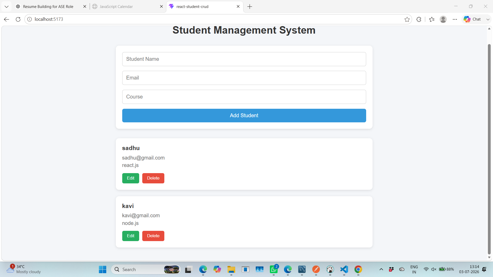

# 🎓 Student Management System

A Full Stack Student Management System developed using **React.js**, **Node.js**, **Express.js**, and **MySQL**.

The application allows users to perform complete CRUD (Create, Read, Update, Delete) operations on student records through a responsive user interface and RESTful APIs.

---

## 🚀 Features

- Add a new student
- View all students
- Update student details
- Delete students
- Form validation
- REST API integration
- MySQL database connectivity
- Responsive UI

---

## 🛠️ Technology Stack

### Frontend
- React.js
- JavaScript (ES6+)
- HTML5
- CSS3
- Axios

### Backend
- Node.js
- Express.js

### Database
- MySQL

### Development Tools
- Visual Studio Code
- Postman
- MySQL Workbench
- DBeaver
- Git & GitHub

---

## 📂 Project Structure

```text
student-crud-react/
│
├── public/
│
├── src/
│   ├── api/
│   │   └── studentApi.js
│   │
│   ├── components/
│   │   ├── StudentCard.jsx
│   │   ├── StudentForm.jsx
│   │   └── StudentList.jsx
│   │
│   ├── hooks/
│   │   └── useStudents.js
│   │
│   ├── pages/
│   │   └── StudentPage.jsx
│   │
│   ├── services/
│   │   └── studentService.js
│   │
│   ├── utils/
│   │   └── validation.js
│   │
│   ├── App.jsx
│   └── main.jsx
│
├── screenshots/
├── docs/
├── README.md
├── package.json
└── vite.config.js
```

---

## 📸 Application Screenshots

### Home Page



### Add Student


### Edit Student


### Delete Student


---

## ⚙️ Installation

### Clone the repository

```bash
git clone https://github.com/your-username/student-crud-react.git
```

### Navigate to the project

```bash
cd student-crud-react
```

### Install dependencies

```bash
npm install
```

### Start the application

```bash
npm run dev
```

The application will run at:

```
http://localhost:5173
```

---

## 🏗️ Frontend Architecture

```
React Components
        │
        ▼
Custom Hooks
        │
        ▼
Services
        │
        ▼
Axios API
        │
        ▼
Node.js Backend
```

---

## 🚀 Future Improvements

- Search students
- Filter by course
- Pagination
- Authentication (JWT)
- Role-based access
- Responsive design enhancements
- Toast notifications


---

## 📚 Documentation

Detailed project documentation is available in the **docs** folder.

| Document | Description |
|----------|-------------|
| [Folder Structure](docs/folder-structure.md) | Explains the frontend folder organization and responsibilities. |
| [Architecture](docs/architecture.md) | Describes the frontend architecture and data flow. |


---

## 👨‍💻 Author

**Kavikuil K**

- GitHub: https://github.com/your-username
- LinkedIn: https://linkedin.com/in/your-profile